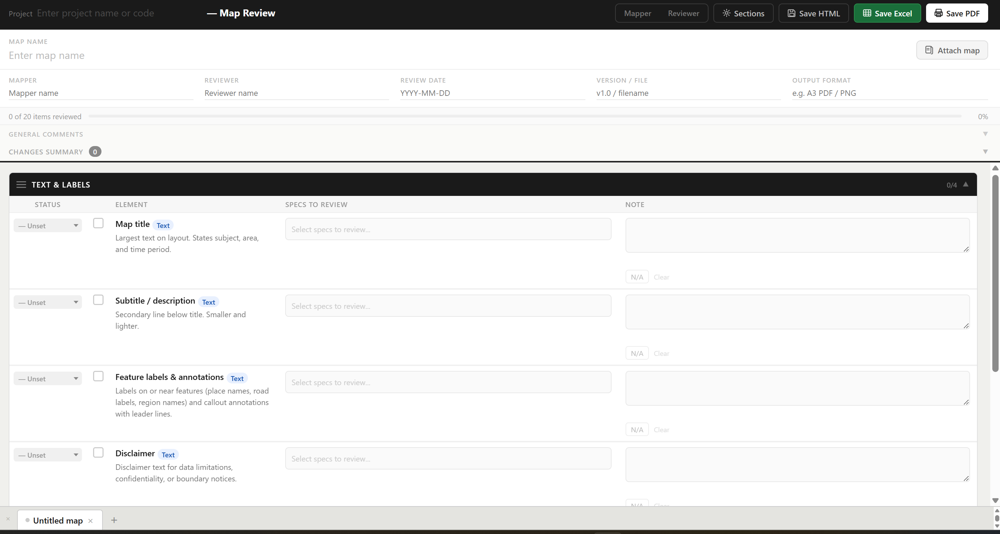

# Carto Review
 
A self-contained HTML tool for structured, multi-round cartographic map reviews — built for GIS teams that pass files back and forth between mappers and reviewers without a shared project management system.
 
**No installation. No server. No account.** Open the file, fill it in, save it.
 
🔗 **[Live demo carto-review](https://chhyang17.github.io/carto-review/)

---
 
## The problem it solves
 
Map review in small GIS teams typically looks like this:
 
1. Mapper sends a PDF or layout file
2. Reviewer jots notes in an email or shared spreadsheet
3. Mapper makes changes, sends a new version
4. Nobody can remember what was flagged in Round 1 vs Round 2
5. Comments get overwritten, status gets lost, the spreadsheet becomes unreliable
 
This tool makes the review file the source of truth. Every round of comments is preserved. The file travels with the work.
 
---
 
## Features
 
### Core workflow
- **Mapper / Reviewer mode toggle** — set who is currently filling in the form; the mode is saved into the HTML so the file remembers when re-opened
- **Save HTML** — checkpoints the entire state (all maps, all notes, full history) into a self-restoring file you can email, commit, or share
- **Save Excel** — exports a formatted workbook with one sheet per map, a Project Overview tab, and an accumulating Change Log
- **Save PDF** — prints the active map tab as a clean PDF via the browser
 
### Per-element checklist
- 7 built-in review sections covering **19 cartographic elements** across Text & Labels, Legend, Base Layer, Symbology, Scale & North Arrow, Layout & Composition, and Export Quality
- **Dynamic symbology section** — add one row per data layer with name, geometry type (point / line / polygon / raster), spec selectors, and notes
- **Status per element**: Mapper to fix · Need guidance · Good · Unset
- **Specs reviewed** — multi-select pill selector scoped to each element's relevant properties
- **N/A toggle** — locks the row (grey background, all inputs disabled) while keeping it visible; N/A rows are greyed out in Excel too
 
### Custom sections (per map tab)
- **⚙ Sections** button opens a full section editor modal
- Add extra elements to any built-in section (e.g. add "Coordinate system" to Base Layer)
- Create entirely new custom sections with custom elements, tags, descriptions, and specs
- Customizations are **per map tab** — each tab can have a different checklist structure
- All customizations persist through Save HTML and export correctly to Excel
 
### Audit history
- **Per-round history** under each element — collapsed by default, expands to show every export round with timestamp, note, and status chip
- **Direction label per round** — "Sent for review" (mapper) or "Reviewer comments" (reviewer), with the person's name from the meta fields
- **General comment box** per map (collapsed by default) with its own history of previous rounds
- **Changes summary strip** — live count of flagged items (excludes Good), with a Rectified button that removes items from the summary while preserving full history
 
### Multi-map support
- Unlimited map tabs per project
- Sections are drag-to-reorder per tab
- Attach a reference PDF or image per map — renders in a floating panel alongside the checklist
- Progress bar per map (checked items / total non-N/A items)
 
### Excel export detail
- **Project Overview** — one row per map with Mapper, Reviewer, date, version, and progress percentage
- **One sheet per map** — columns: ✓ | Section | Element | Type | Status | Specs Reviewed | Current Note | audit history columns (grow automatically with each export)
- **Audit column headers** include direction and person name: `1st Mapper Submission · CY` / `1st Review Comments · JS`
- **N/A rows** rendered in grey across all columns
- **Change Log sheet** — every Save Excel appends a timestamped block per map showing which elements changed, the new status ("Changed to: Mapper to fix"), and the note; colour-coded by mapper (orange) vs reviewer (blue)
 
---
 
## How to use
 
### First time
1. Download `index.html` and open it in any modern browser (Chrome, Edge, Firefox, Safari)
2. Enter your project code in the top bar
3. Set the mode to **Mapper** or **Reviewer**
4. Add a map tab, fill in the meta fields (mapper name, reviewer name, date, version)
5. Work through the checklist sections
 
### Passing the file back and forth
1. **Mapper** fills in notes and statuses, clicks **Save HTML**
2. Sends the `.html` file to the reviewer
3. **Reviewer** opens it, switches mode to **Reviewer**, adds comments per element
4. Reviewer clicks **Save Excel** to generate the audit record, then **Save HTML** to send back
5. Mapper opens the returned file — all previous rounds are visible in each element's history
 
### Adding custom sections or fields
1. Click the **⚙ Sections** button in the top bar
2. Select a built-in section to add extra elements to it, or click **+ Add custom section** for a new one
3. For each element, set the name, tag, description, and specs list
4. Click **Done** — the checklist updates immediately
 
> Custom sections and extra fields apply to the currently active map tab only. Different maps in the same project can have different checklist structures.
 
### Reading the element history
Click the clock icon under any element row to expand its history. Each export round shows:
- Round number and timestamp
- The note written at time of export
- Status at that point (e.g. Mapper to fix → Good)
- Who submitted it and in which direction
 
---
 
## Built-in sections and elements
 
| Section | Elements |
|---|---|
| Text & Labels | Map title, Subtitle / description, Feature labels & annotations, Disclaimer |
| Legend | Legend text, Legend symbology, Legend layout |
| Base layer | ESRI base layer, Terrain base layer, Administrative boundaries, Other base layers |
| Symbology — data layers | Dynamic — add one row per data layer |
| Scale & North Arrow | Scale bar, North arrow, Zoom level / scale |
| Layout & composition | Page setup & margins, Visual hierarchy, Inset map (if present) |
| Export quality | Resolution, Export format |
 
---
 
## Technical notes
 
- **Single file, zero runtime dependencies** — the XLSX export library loads from a CDN (`cdn.jsdelivr.net`); everything else is vanilla HTML / CSS / JS
- **No data leaves the browser** — all state lives in memory and is serialised into the saved HTML file; nothing is sent to any server
- **State persistence** — Save HTML serialises the full application state (maps, rows, history, mode, custom sections, attached files) into a `<script>` block in the saved file; opening the file restores everything automatically
- **Attached files** are base64-encoded into the saved HTML — large PDFs will increase file size noticeably
- Tested in Chrome 120+, Edge 120+, Firefox 121+
 
---
 
## Background
 
Built by a GIS practitioner to solve a real workflow problem — multiple maps per project, multiple revision rounds, two or three people involved, no shared project management system.
 
The tool is intentionally file-based rather than cloud-based: it works offline, it travels with the project folder, and it doesn't require anyone to have an account.
 
---
 
## License
 
MIT — use it, adapt it, share it.
 
If you find it useful, a ⭐ on GitHub is appreciated.
 
---
 
## Possible future additions
 
- Template system — save a custom section configuration and load it into new projects
- Batch PDF export — print all map tabs in one action
- Section-level notes field
- Dark mode
